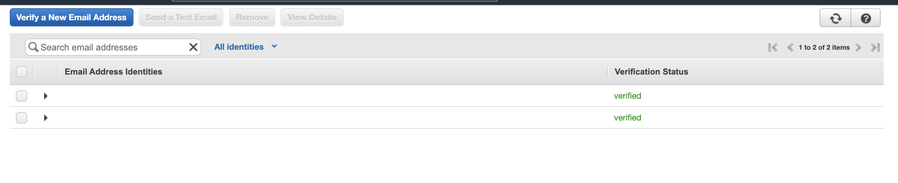
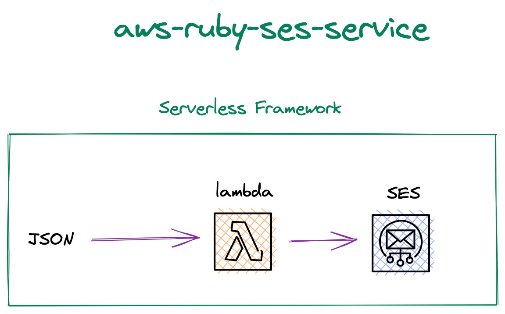
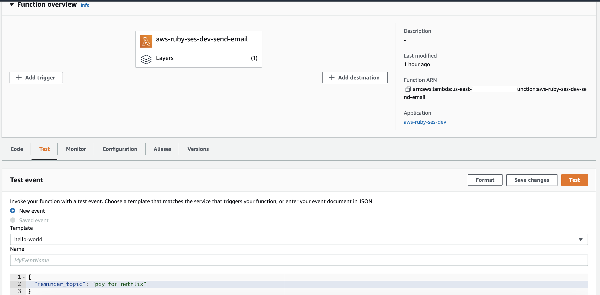
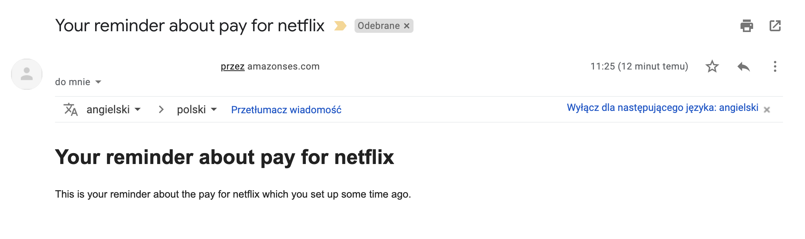
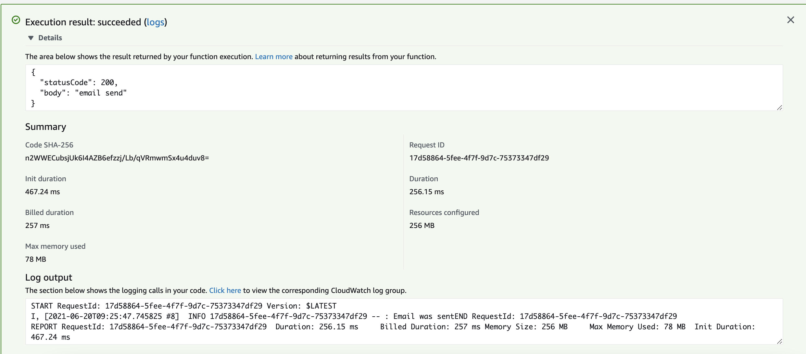
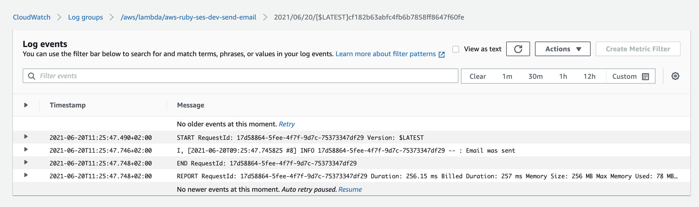

# Serverless AWS Ruby SES example

Serverless project example which sending email. `AWS Lambda` and `Amazon SES` were used. The repository is used for the purpose of this [blogpost](https://www.danielaniszkiewicz.com/aws-step-functions-workflow-studio.html).

# Prerequistes

Make sure to validate `sender` and `recipient` emails within the `Amazon SES` (most likely it will be one `email`):



Within the project add `.env` and fill it with:

```bash
SENDER=sender_email
RECIPIENT=recipient_email
```

## Diagram





## Setup

`npm install` to install all needed packages.

## Deployment

In order to deploy the service run:

```bash
sls deploy
```

for deploying with a specific `profile` (located in `~/.aws/credentials`) you can simply use the command:

```bash
AWS_PROFILE=YOUR_PROFILE_NAME sls deploy
```

for deploying to the specific stage, let's say `staging` do:

```bash
sls deploy --stage staging
```

The expected result should be similar to:

```bash
Serverless: Running "serverless" installed locally (in service node_modules)
Serverless: Packaging service...
Serverless: Excluding development dependencies...
Serverless: Clearing previous build ruby layer build
[ '2.1' ]
Serverless: Installing gem using local bundler
Serverless: Zipping the gemfiles tovserverless-aws-ruby-ses/.serverless/ruby_layer/gemLayer.zip
Serverless: Configuring Layer and GEM_PATH to the functions
Serverless: Uploading CloudFormation file to S3...
Serverless: Uploading artifacts...
Serverless: Uploading service aws-ruby-ses.zip file to S3 (73.21 KB)...
Serverless: Uploading service gemLayer.zip file to S3 (551.13 KB)...
Serverless: Validating template...
Serverless: Updating Stack...
Serverless: Checking Stack update progress...
..............
Serverless: Stack update finished...
Service Information
service: aws-ruby-ses
stage: dev
region: us-east-1
stack: aws-ruby-ses-dev
resources: 7
api keys:
  None
endpoints:
  None
functions:
  send-email: aws-ruby-ses-dev-send-email
layers:
  gem: arn:aws:lambda:us-east-1:XXXXXXXXXXXXX:layer:aws-ruby-ses-dev-ruby-bundle:30
```

## Usage

After the deployment, simply test the deployed `lambda function`:

In the `AWS dashboard`:

Click on `test`, provide the payload:

```json
{
  "reminder_topic": "pay for netflix"
}
```

and click `test`.



If your setup is correct (make sure about validating emails), you should see the email on your mailbox:




You will the success log:

 

 Logs could be also checked within `Cloudwatch`:

 


## Log retention

The log retention is setup for 30 days. To change it simply change the value of this attribute in the `serverless.yml` file:


``` bash
logRetentionInDays: 30
```

## Structure

| Path                                          | Explanation                                                                                                                                                     |
|-----------------------------------------------|-----------------------------------------------------------------------------------------------------------------------------------------------------------------|
| `./src`                                       | All code for the project.                                                                                                                                       |
| `./src/handlers/send-email`                   | Handler for lambda.                                                                                                                                             |
| `./src/common/`                               | Space for common, reusable pieces of code.                                                                                                                      |
| `./src/common/adapters/ses_adapter.rb`        | Adapter for the Amazon SES with the usage of AWS SDK for Ruby. Only used for sending emails.                                                                    |
| `./src/common/services/send_email_service.rb` | The service object pattern is widely used within ruby/rails developers. A class that is responsible for doing only one thing. In our case is creating an email. |

## Serverless plugin

For this example, there is one serverless plugins used:

| Plugin                | Explanation                                                               |
|-----------------------|---------------------------------------------------------------------------|
| [serverless-ruby-layer](https://www.npmjs.com/package/serverless-ruby-layer) | For bundling ruby gems from Gemfile and deploys them to the lambda layer. |

## Ruby gems

| Gem           | Explanation                                                                                             |
|---------------|---------------------------------------------------------------------------------------------------------|
| `aws-sdk-ses` | It's a part of the AWS SDK for Ruby. Used for Amazon SES, in the case of this example - sending emails. |

## Remove service

To remove the service do:

```
sls remove
```
And the stack will be removed from the AWS.